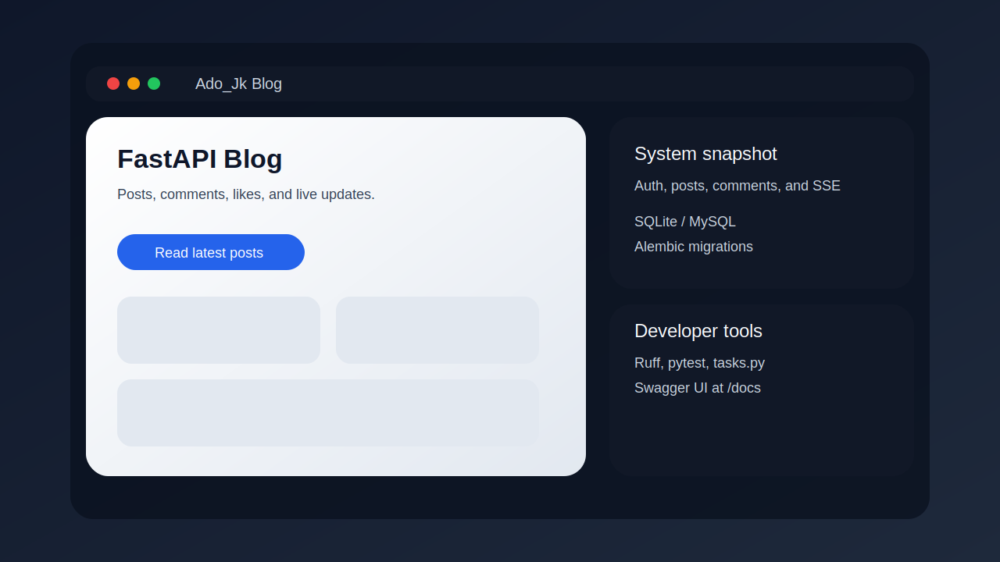
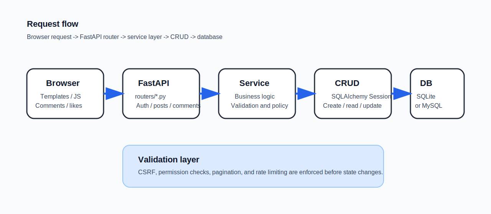

# Ado_Jk Blog


A compact FastAPI blog for publishing posts, managing users, and handling comments with real-time updates.

一个面向个人内容发布、用户互动和工程实践的 FastAPI 个人博客项目。

## Why

This project started as a hands-on backend playground: small enough to understand in one sitting, but rich
enough to practice real-world patterns such as auth, migrations, CSRF protection, pagination, likes, and SSE.

这个项目的目标是做一个“足够小、又足够真实”的后端练习场，方便在同一套代码里练习认证、迁移、
CSRF、分页、点赞和实时推送等常见能力。

## Table of Contents

- [Features](#features)
- [System Requirements](#system-requirements)
- [Quick Start](#quick-start)
- [Installation](#installation)
- [Configuration](#configuration)
- [Usage Examples](#usage-examples)
- [API and Commands](#api-and-commands)
(#authors-and-acknowledgments)

## Features

| Area | Highlights |
| --- | --- |
| Authentication | Register, login, logout, refresh token, avatar upload, cookie-based session handling |
| Posts | List, detail, top ranking, random entry, create, soft delete, like and unlike |
| Comments | Paginated CRUD, nested replies, like and unlike, rate limit, SSE comment stream |
| Engineering | SQLAlchemy ORM, Alembic migrations, CSRF protection, pytest, Ruff, task runner |
| Admin workflow | Admin-only post publishing, profile avatar management, permission checks |

### Preview





## System Requirements

| Item | Minimum | Recommended |
| --- | --- | --- |
| Python | 3.10 | 3.11 or newer |
| OS | Windows, macOS, Linux | Any system with Python and Git |
| Database | SQLite | MySQL for multi-user deployments |
| Cache | Optional Redis | Redis for rate limiting and future extension |
| Browser | Modern Chromium, Firefox, or Safari | Latest stable version |

## Quick Start

1. Clone the repository.
2. Create a virtual environment.
3. Install dependencies.
4. Copy `.env.example` to `.env`.
5. Run database migrations.
6. Start the app.

```powershell
# 中文：克隆仓库并进入项目目录
git clone https://github.com/duxiaokk/my_blog.git
cd my_blog

# 中文：创建并激活虚拟环境
python -m venv .venv
.venv\Scripts\Activate.ps1

# 中文：安装依赖并初始化数据库
python -m pip install -r requirements.txt
copy .env.example .env
python tasks.py db-upgrade head

# 中文：启动开发服务器
python tasks.py run --host 127.0.0.1 --port 8000
```

```bash
# English: clone the repository and enter the project directory
git clone https://github.com/duxiaokk/my_blog.git
cd my_blog

# English: create and activate a virtual environment
python3 -m venv .venv
source .venv/bin/activate

# English: install dependencies and initialize the database
python -m pip install -r requirements.txt
cp .env.example .env
python tasks.py db-upgrade head

# English: start the development server
python tasks.py run --host 127.0.0.1 --port 8000
```

Open `http://127.0.0.1:8000` in your browser. The Swagger-like docs are available at `http://127.0.0.1:8000/docs`.

## Installation

### Windows PowerShell

```powershell
python -m venv .venv
.venv\Scripts\Activate.ps1
python -m pip install --upgrade pip
python -m pip install -r requirements.txt
python -m pip install -r requirements-dev.txt
```

### macOS and Linux

```bash
python3 -m venv .venv
source .venv/bin/activate
python -m pip install --upgrade pip
python -m pip install -r requirements.txt
python -m pip install -r requirements-dev.txt
```

## Configuration

Create a `.env` file from `.env.example` and adjust the values below.

| Variable | Purpose | Example |
| --- | --- | --- |
| `DATABASE_URL` | Full database URL, overrides split DB fields | `sqlite:///./blog.db` |
| `USE_MYSQL` | Switch to MySQL when `true` | `false` |
| `DB_USER` | MySQL username | `root` |
| `DB_PASSWORD` | MySQL password | `secret` |
| `DB_HOST` | MySQL host | `127.0.0.1` |
| `DB_PORT` | MySQL port | `3306` |
| `DB_NAME` | MySQL database name | `my_blog_db` |
| `SECRET_KEY` | JWT and cookie signing secret | `please-change-this` |
| `ADMIN_USERNAME` | Username allowed to publish and delete posts | `Ado_Jk` |
| `TECH_TAGS` | Comma-separated tech tags for the homepage | `Python,FastAPI,SQLAlchemy,SQLite` |
| `REDIS_URL` | Optional Redis URL | `redis://localhost:6379/0` |

Example `.env`:

```dotenv
DATABASE_URL=sqlite:///./blog.db
SECRET_KEY=please-change-this-secret-key
ALGORITHM=HS256
ACCESS_TOKEN_EXPIRE_MINUTES=30
REFRESH_TOKEN_EXPIRE_DAYS=30
ADMIN_USERNAME=Ado_Jk
TECH_TAGS=Python,FastAPI,SQLAlchemy,SQLite
REDIS_URL=
```

## Usage Examples

### Browse the site

```powershell
# 中文：打开首页、技术栈页和文章详情页
Start-Process "http://127.0.0.1:8000/"
Start-Process "http://127.0.0.1:8000/top"
Start-Process "http://127.0.0.1:8000/posts/1"
```

```bash
# English: open the home page, tech page, and a post detail page
xdg-open "http://127.0.0.1:8000/"
xdg-open "http://127.0.0.1:8000/top"
xdg-open "http://127.0.0.1:8000/posts/1"
```

### Submit a comment

```powershell
# 中文：先获取 CSRF token，再提交评论
$csrf = (Invoke-RestMethod "http://127.0.0.1:8000/csrf-token").csrf_token
Invoke-RestMethod `
  -Method Post `
  -Uri "http://127.0.0.1:8000/posts/1/comments" `
  -Headers @{ "X-CSRF-Token" = $csrf } `
  -ContentType "application/json" `
  -Body '{"content":"Nice post!","parent_id":null}'
```

```bash
# English: fetch a CSRF token, then submit a comment
csrf=$(python - <<'PY'
import json
import urllib.request

print(json.load(urllib.request.urlopen("http://127.0.0.1:8000/csrf-token"))["csrf_token"])
PY
)
curl -s -X POST "http://127.0.0.1:8000/posts/1/comments" \
  -H "X-CSRF-Token: $csrf" \
  -H "Content-Type: application/json" \
  -d '{"content":"Nice post!","parent_id":null}'
```

## API and Commands

### API

| Method | Path | Auth | Description |
| --- | --- | --- | --- |
| `POST` | `/login` | No | Login and set auth cookies |
| `POST` | `/register` | No | Register a new user |
| `GET` | `/api/v1/posts/{post_id}` | Optional | Fetch a post detail payload |
| `POST` | `/api/v1/posts/{post_id}/like` | Optional | Toggle post like |
| `DELETE` | `/api/v1/posts/{post_id}` | Optional | Soft delete a post |
| `GET` | `/posts/{post_id}/comments` | Optional | List comments with pagination |
| `GET` | `/posts/{post_id}/comments/stream` | No | Stream comment events with SSE |
| `POST` | `/posts/{post_id}/comments` | Yes | Create a comment |
| `PUT` | `/comments/{comment_id}` | Yes | Edit a comment |
| `DELETE` | `/comments/{comment_id}` | Yes | Delete a comment |
| `POST` | `/comments/{comment_id}/like` | Optional | Toggle comment like |

### Commands

| Command | Purpose |
| --- | --- |
| `python tasks.py lint` | Run Ruff checks |
| `python tasks.py format --check` | Verify formatting |
| `python tasks.py test` | Run the test suite |
| `python tasks.py run` | Start the development server |
| `python tasks.py db-upgrade head` | Apply Alembic migrations |
| `python -m alembic upgrade head` | Direct migration command |

## Changelog

No tagged releases exist yet, so this section tracks local milestones in reverse chronological order.

- `2026-04-27` - Removed the AI persona chat module and dropped the related database tables.
- `2026-04-27` - Refreshed the README structure, examples, and contribution guidance.
